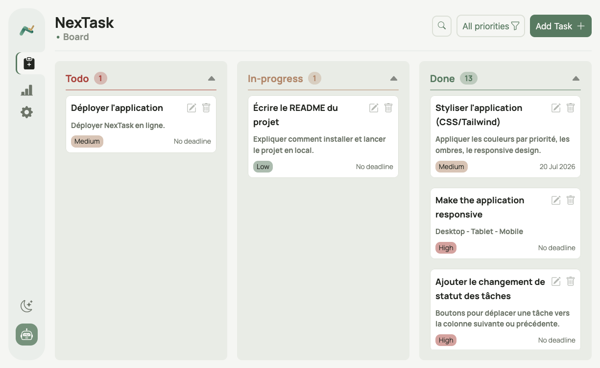
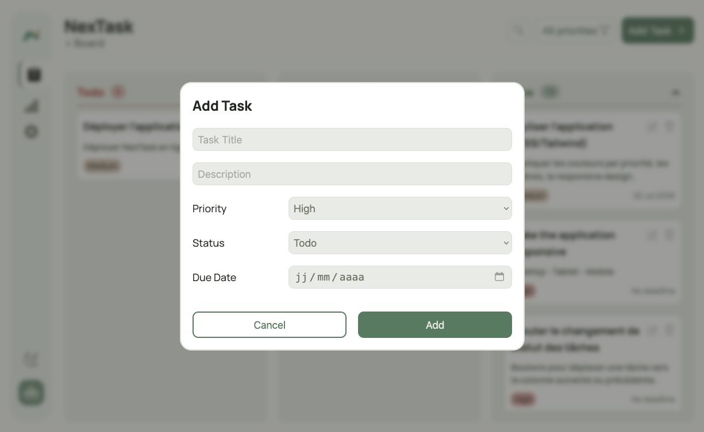
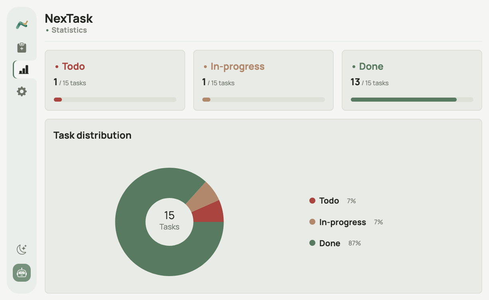
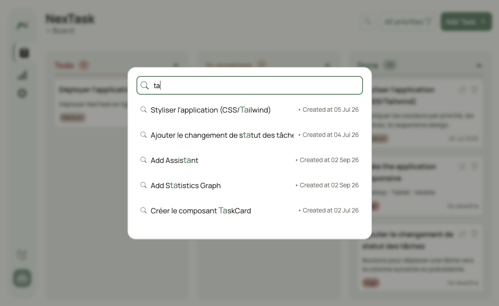
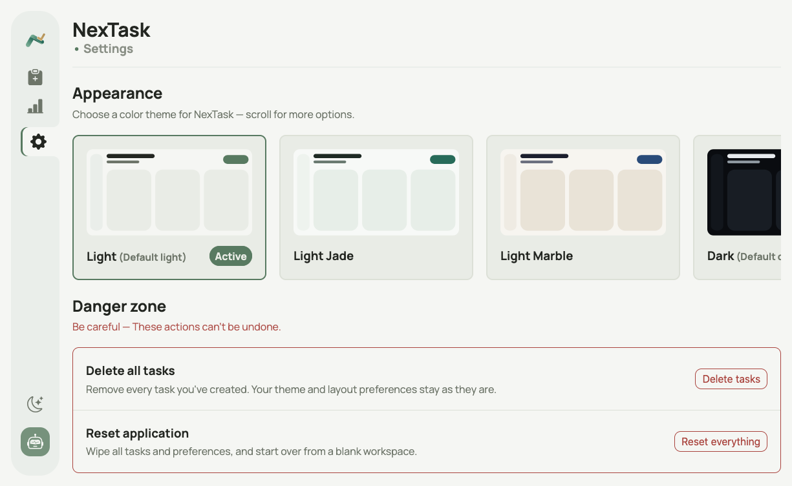
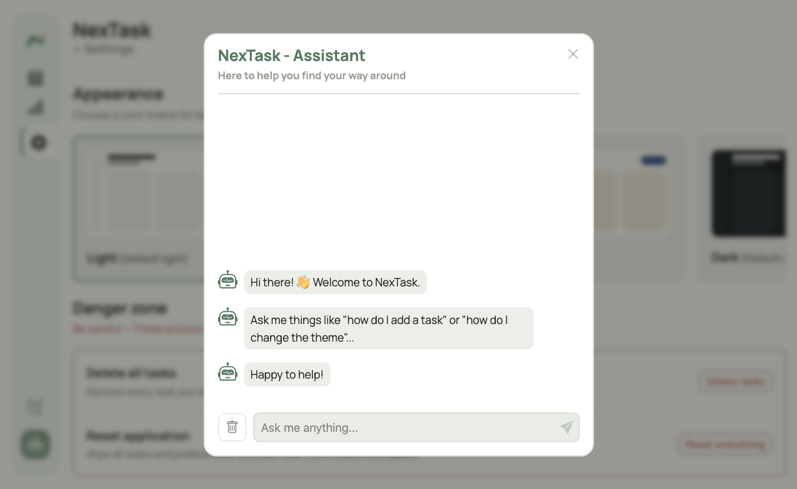

# NexTask 📋
> A modern Kanban-style task manager built with React 19.


[](https://nextasks.netlify.app)

---

## 🔗 Live Demo
[nextasks.netlify.app](https://nextasks.netlify.app)

---

## Preview

| **📋 Board** | **✏️ Task Form** |
|---|---|
|  |  |

| **📊 Statistics** | **🔍 Search** |
|---|---|
|  |  |

| **⚙️ Settings** | **🤖 Assistant** |
|---|---|
|  |  |

---

## Overview
NexTask is a fully client-side Kanban task manager built from scratch with React 19. It lets you organize tasks across three stages — Todo, In-progress, and Done — with drag and drop support, priority filtering, keyword search, a statistics dashboard, six color themes, and a built-in assistant. All data persists automatically via localStorage.

---

## Features

### 📋 Board
- Kanban board with three columns — Todo, In-progress, Done
- Drag and drop tasks between columns with `@dnd-kit/react`
- Add, edit, and delete tasks with confirmation dialog
- Task cards showing title, description, priority badge, and due date
- Overdue indicator for tasks past their deadline
- Filter tasks by priority (All, High, Medium, Low)
- Task counter per column

### 🔍 Search
- Real-time search by task title
- Character-level keyword highlighting in results
- Click a result to view full task details

### 📊 Statistics
- Task count cards per status with progress bars
- Donut chart showing task distribution (Todo / In-progress / Done)
- Powered by Recharts

### ⚙️ Settings
- **Appearance** — 6 color themes with live preview cards
- **Danger Zone** — delete all tasks or reset everything

### 🤖 Assistant
- Built-in keyword-matching help assistant
- Answers questions about tasks, priorities, themes, and settings
- Typing delay for a natural feel
- Chat history persisted in localStorage

### 💾 Data Persistence
- All tasks, theme, sidebar state, and chat history saved to localStorage via a custom `useLocalStorage` hook
- Data persists across page refreshes

### 📱 Responsive Design

NexTask is designed to work across different screen sizes, including:

- Desktop
- Tablet
- Mobile

---

## Tech Stack

| Layer | Technology |
|---|---|
| UI Library | React 19 |
| Build Tool | Vite 8 |
| Routing | React Router 8 |
| Drag & Drop | @dnd-kit/react |
| Charts | Recharts |
| Date Handling | Day.js |
| Styling | Vanilla CSS with CSS variables |
| Data Storage | localStorage (custom hook) |

---

## Project Structure

```
src/
├── assets/
├── components/
│   ├── Assistant/        → Chatbot modal with keyword matching
│   ├── Board/            → Kanban board, columns, task cards, forms, search
│   ├── ConfirmDialog/    → Reusable confirmation modal
│   ├── Header/           → Page header with conditional actions
│   ├── Modal/            → Reusable modal
│   ├── Settings/         → Appearance and danger zone
│   ├── Sidebar/          → Navigation sidebar with theme toggle
│   └── Statistics/       → Statistics cards and pie chart
├── data/
│   └── data.json         → Default tasks loaded on first visit
├── hooks/
│   └── useLocalStorage.js → Custom hook for persistent state
├── pages/
│   ├── BoardPage/
│   ├── StatisticsPage/
│   └── SettingsPage/
├── utils/
│   ├── getReply.js       → Chatbot keyword matching logic
│   └── localStorage.js   → localStorage read/write helpers
├── App.css
├── App.jsx
├── index.css
└── main.jsx
```

---

## Getting Started

### Requirements
- Node.js
- npm

### Installation

1. Clone the repository
```bash
git clone https://github.com/MedBuilds/nex-task.git
```

2. Navigate to the project folder
```bash
cd nex-task
```

3. Install dependencies
```bash
npm install
```

4. Start the development server
```bash
npm run dev
```

5. Open your browser at:
```
http://localhost:5173
```

---


## Author
**MedBuilds**
Full-Stack Developer in training
GitHub: [@MedBuilds](https://github.com/MedBuilds)

---

> *"Plan • Focus • Achieve"*